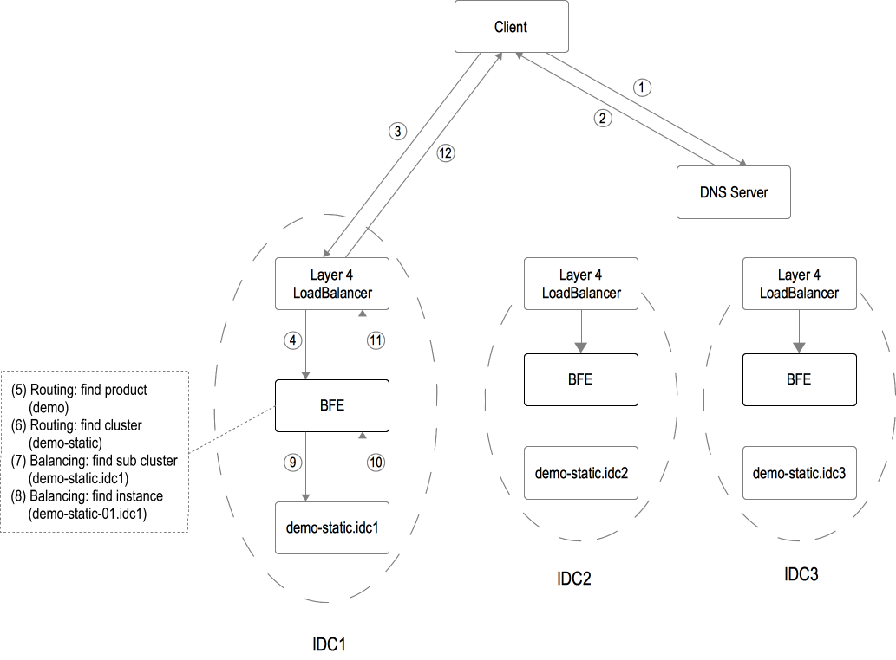

# Traffic forwarding

- Step 1-2：DNS resolution
    - The hostname to resolve is demo.example.com
    - The translated IP address from DNS server is 6.6.6.6（example）

- Step 3：The client creates a TCP connection to 6.6.6.6 on port 80 and send a HTTP request. The IP diagrams are routed to PoP of IDC1，and processed by the Layer 4 Load Balancer.

- Step 4：The Layer 4 Load Balancer forwards diagrams to BFE.

- Step 5：BFE receives an HTTP request and find a product for it:
    - BFE uses the HTTP Host header to find the suitable product.
    - In this scenario, assume demo.example.com belongs to product "demo".

- Step 6：Based on routing rules of product "demo", BFE finds a suitable cluster to process the request.
    - In this scenario, assume the selected cluster is "demo-static".
    - See [Traffic routing](route.md)

- Step 7-8：Based on balacing policies of product "demo", BFE selects a sub cluster and an instance within cluster "demo-static" 
    - In this scenario, assume the selected sub cluster is "demo-static.idc1" and the selected instance is "demo-static-01.idc1" .
    - See [Traffic balancing](balance.md)

- Step 9：The request is forwarded to "demo-static-01.idc1".

- Step 10：BFE receives a response from "demo-static-01.idc1".

- Step 11-12：BFE forwards the response to the client via the Layer 4 Load Balancer.
