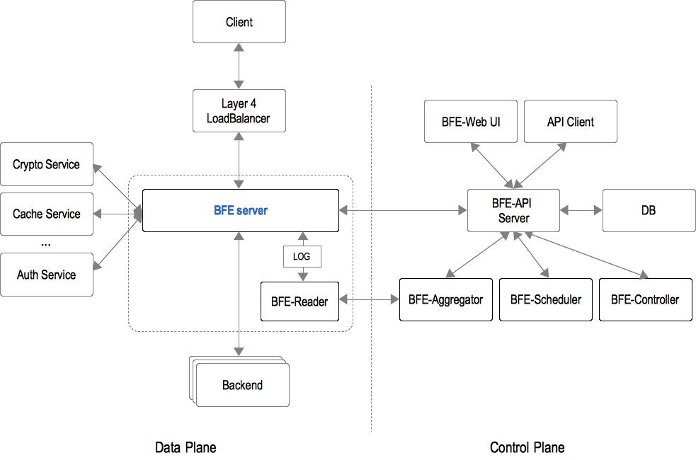

# 概览

## BFE是什么

BFE是基于百度统一接入前端开源的七层流量接入系统。

## 功能特性及优点

* 基于Golang构建

基于内存安全语言构建无缓冲区溢出安全漏洞隐患；具备异常捕获容错处理能力避免进程异常退出；兼容支持Linux/Windows/MacOS等多平台运行。

* 灵活的模块框架

内置灵活的模块框架，支持高效率定制开发第三方扩展模块。

* 面向多租户架构

基于多租户架构设计，租户之间配置相互隔离。

* 支持丰富的接入协议

支持HTTP，HTTPS，SPDY，HTTP/2，WebSocket，TLS等。未来计划支持gRPC, HTTP/3。

* 基于请求内容路由

支持[高级条件表达式](../condition/condition_grammar.md)定制转发规则，转发规则易于理解及维护。

* 高级负载均衡

支持全局/分布式负载均衡，实现就近访问、跨可用区容灾及过载保护等。

* 丰富的扩展模块

提供丰富的流量管理、安全防攻击、可见性等相关扩展模块。

* 一流的可见性

提供丰富详尽的监控指标；提供各类日志（服务日志/访问日志/TLS Key日志）供问题诊断、数据分析及可视化；BFE还支持请求分布式Tracing。

* 兼容适配主流生态项目

兼容适配主流四层负载均衡方案，及其它生态项目如Kubernetes、Prometheus、Jaeger、Fluentd等。

## 功能组件

BFE包含了多个组件，部分是可选的:

* BFE Server: BFE数据平面核心转发模块(必选，已开源）

* BFE-Reader: BFE日志分析模块，与BFE Server部署在一起，用于对BFE日志进行本地汇聚计算，降低后续计算处理的数据规模。

* BFE-API Server: BFE控制平面API Server，其它控制平面模块以BFE-API Server为核心协同工作。

* BFE-Aggregator: BFE日志数据实时聚合计算模块。

* BFE-Scheduler: BFE流量调度器，基于流量、容量、网络距离及质量，自动计算全局负载均衡(GSLB)策略。

* BFE-Controller: BFE集群控制器，执行常规控制任务，例如异常巡检及报警。

* BFE-Web UI: BFE Web控制台。

* 其它周边依赖系统, 例如缓存服务、非对称密码学算法计算服务等。

## 架构介绍

下图展示了BFE的架构及BFE生态中的一些依赖系统。

### 数据平面

用户流量经四层负载均衡设施达到BFE Server。BFE Server在转发流量过程中，可能会访问多个依赖的服务。并经过内容路由、负载均衡，最终转发给合适的后端集群。关于流量接入转发的详细过程，可以进一步阅读[流量接入转发模型](forward_model.md) 。

### 控制平面

BFE租户通过BFE-Web UI或BFE-API管理流量接入及转发策略。此外，控制平面还负责执行全局性决策（例如全局负载均衡策略计算）及集群级别其它管理工作（例如集群级别异常巡检及处理等）。

